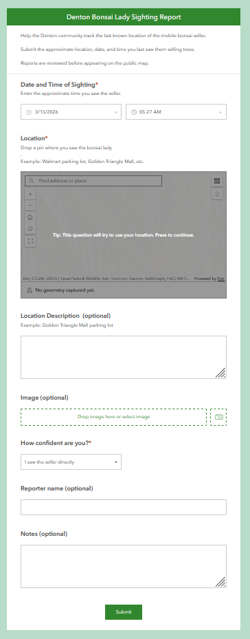
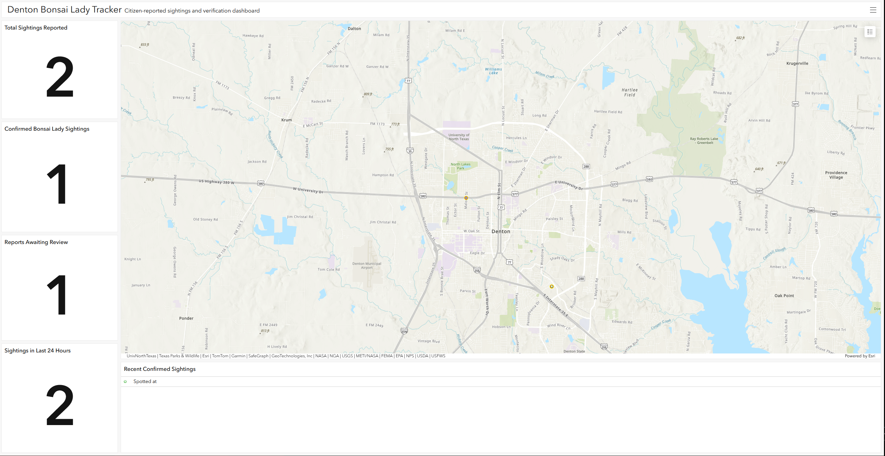

# Denton Bonsai Lady Tracker

A crowdsourced geospatial reporting system that allows residents of Denton, Texas to report the last known location of a mobile bonsai tree seller.

The application uses ArcGIS Online tools to collect, moderate, and visualize sightings on an interactive map.

## Purpose

This project demonstrates how cloud GIS platforms can be used to build lightweight community reporting tools with real-time spatial visualization.

## Live Application

Dashboard  
https://tamu.maps.arcgis.com/apps/dashboards/38ed726a6f7f4590afc1c7ac0584b9ae

Submit a Sighting  
https://arcg.is/WiLib0

## Technologies Used

- ArcGIS Online
- Survey123
- Hosted Feature Layers
- ArcGIS Web Maps
- ArcGIS Dashboards
- ArcGIS Experience Builder (optional)

## System Architecture

The system uses ArcGIS Online to create a lightweight crowdsourced spatial reporting workflow.

1. A user submits a sighting through a Survey123 form.
2. The report is stored in a hosted feature layer.
3. Reports enter the system with a **Pending** status.
4. A moderator reviews the report and marks it as **Approved** or **Rejected**.
5. Approved sightings appear on the public dashboard and web map.
6. Dashboard indicators update automatically.

## Survey123 Reporting Form

The application uses an ArcGIS Survey123 form to collect sightings from the community.

Users submit the date, location, optional photo, and confidence level for each report.

*Figure 1: Survey123 form used to collect crowdsourced bonsai sightings.*

## Dashboard

*Figure 2: Operational dashboard showing confirmed sightings and moderation indicators.*

## Workflow

1. User submits a sighting using Survey123
2. Submission enters the feature layer as **pending**
3. Moderator reviews the submission
4. Approved sightings appear on the public map
5. Dashboard updates with the latest location

## Feature Layer Schema

| Field | Type | Description |
|------|------|-------------|
| Date_and_Time_of_Sighting | Date | Time the bonsai seller was seen |
| Location | Text | Location description provided by reporter |
| Notes | Text | Additional comments |
| Reporter_name | Text | Optional reporter name |
| Status | Text | Moderation status (Pending / Approved / Rejected) |
| CreationDate | Date | Time report was submitted |

## Dashboard Features

The ArcGIS Dashboard provides a live operational view of reported sightings.

Indicators include:

- Total sightings reported
- Confirmed sightings
- Reports awaiting review
- Sightings reported in the last 24 hours

Additional components:

- Interactive map of Denton sightings
- Moderation-friendly symbology (Pending / Approved / Rejected)
- Recent confirmed sightings feed

## Key GIS Concepts Demonstrated

- Crowdsourced spatial data collection
- Moderated public data submission
- Real-time geospatial dashboards
- Hosted feature layer design
- Spatial filtering and visualization
- 
## Future Improvements

- Automated Reddit and Twitter notifications when sightings are approved
- Hotspot / density analysis of common selling locations
- Prediction of likely future selling areas
- Mobile-first interface using ArcGIS Experience Builder
- Community verification scoring
- Automatic expiration of stale reports

## Disclaimer

This project is intended as a technical demonstration of crowdsourced GIS reporting systems.

All submissions are moderated before appearing on the public map.
The goal is to explore how lightweight spatial tools can support community reporting and visualization.

## Project Status

Operational prototype with active community testing.
